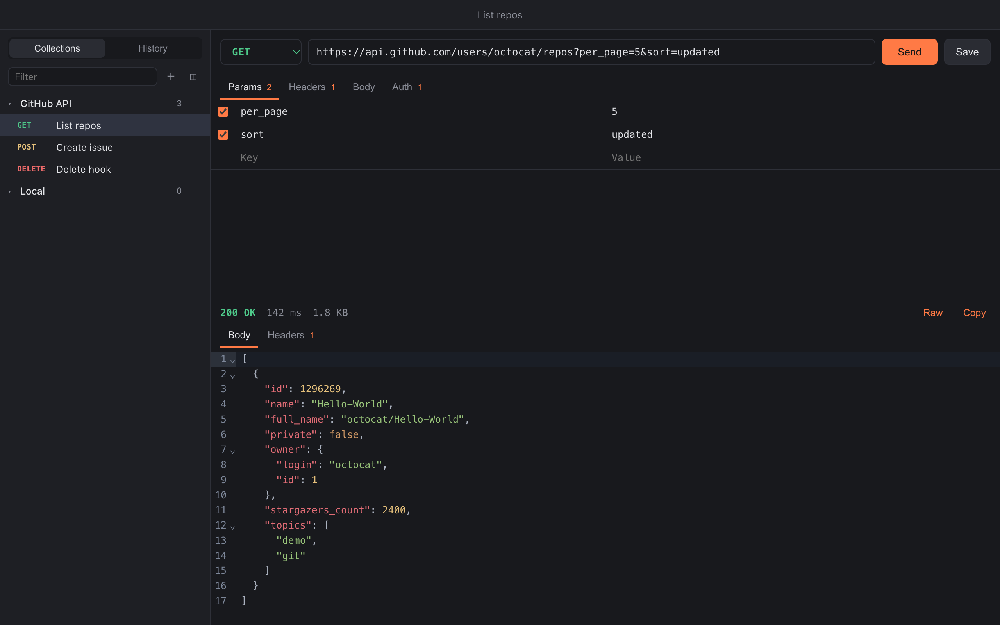

<p align="center">
  
</p>

<h1 align="center">Pigeon</h1>

<p align="center">
  A fast, lightweight HTTP client for macOS.<br>
  No account, no cloud, no telemetry — just your requests, in plain JSON files on your Mac.
</p>

<p align="center">
  <a href="https://github.com/daniel-sabin/pigeon/actions/workflows/ci.yml"></a>
  <a href="LICENSE"></a>
  
</p>

<p align="center">
  
</p>

## Why Pigeon?

Postman and friends have grown into heavy, cloud-connected platforms. Pigeon is the opposite: a small native-feeling app (~10 MB) that starts instantly and does one thing well — send HTTP requests and show you what comes back.

- **Light:** built with Go and the system WebKit view ([Wails](https://wails.io)), not a bundled Chromium.
- **Private:** everything stays on your machine. Pigeon talks to nothing except the servers you send requests to.
- **Yours:** collections and history are readable JSON files you can back up, diff or commit to git.

## Features

**Requests**
- All common methods: `GET`, `POST`, `PUT`, `PATCH`, `DELETE`, `HEAD`, `OPTIONS`
- Query params table, kept in sync with the URL both ways (edit either one)
- Headers table: toggle a row on/off without deleting it
- Body: JSON (with syntax highlighting and one-click formatting), plain text, XML, or URL-encoded form
- Auth helpers: Bearer token and Basic auth
- Cancel a request while it's in flight
- Requests are sent from Go (`net/http`), not from the browser engine, so there are **no CORS restrictions**

**Responses**
- Status, time and size at a glance, color-coded by status class
- Pretty-printed JSON with syntax highlighting and code folding, plus a raw view
- JSON is formatted without parsing numbers, so large integer IDs keep their exact value
- Response headers view
- Image preview; binary content detection
- Copy the body in one click

**Organization**
- Collections: save requests, rename (double-click) and delete them
- History of the last 300 requests, one click to reopen any of them
- Filter collections and history by name or URL

## Installation

Pigeon doesn't have signed releases yet, so the simplest way is to build it from source (it takes about a minute).

### Build from source

Prerequisites: macOS 11+, [Go](https://go.dev/dl/) 1.25+, [Node.js](https://nodejs.org/) 20+ and Xcode Command Line Tools (`xcode-select --install`).

```sh
go install github.com/wailsapp/wails/v2/cmd/wails@latest
git clone https://github.com/daniel-sabin/pigeon.git
cd pigeon
wails build
cp -R build/bin/Pigeon.app /Applications/
```

> If `wails` is not found, add Go's bin directory to your `PATH`: `export PATH="$(go env GOPATH)/bin:$PATH"`.

### From a CI build

Each push to `main` produces a universal (Intel + Apple Silicon) build, available as an artifact of the [CI workflow](https://github.com/daniel-sabin/pigeon/actions/workflows/ci.yml). Because it isn't notarized, macOS will block it the first time. To allow it:

```sh
xattr -dr com.apple.quarantine /Applications/Pigeon.app
```

## Usage

1. Type a URL. Query parameters appear in the **Params** tab as you type — or add them in the table and watch the URL update.
2. Pick a method, add headers, a body or auth if needed.
3. Press **⌘↵** to send.
4. Press **⌘S** to save the request to a collection.

### Keyboard shortcuts

| Shortcut | Action |
|---|---|
| `⌘ ↵` | Send the request |
| `⌘ S` | Save (to its collection, or choose one) |
| `⌘ N` | New request |
| Double-click | Rename a collection or a saved request |

### Good to know

- A URL without a scheme defaults to `http://` (`localhost:8080/health` works).
- Pigeon sets a sensible `Content-Type` based on the body type. A `Content-Type` header you add yourself always wins.
- Response bodies larger than 20 MB are truncated in the viewer (the full size is still reported).
- Proxy settings come from the `HTTP_PROXY` / `HTTPS_PROXY` / `NO_PROXY` environment variables, which macOS only passes to apps launched directly from a terminal (`/Applications/Pigeon.app/Contents/MacOS/Pigeon`).

## Your data

Pigeon stores everything in:

```
~/Library/Application Support/Pigeon/
├── collections.json   # your saved collections and requests
└── history.json       # the last 300 requests sent
```

Both are plain, pretty-printed JSON. To back them up or sync them between machines, copy the folder or put it in a git repository. To reset Pigeon, quit it and delete the folder.

> ⚠️ Tokens and passwords you enter are saved in these files in clear text, just like in a `.http` file or a shell script. Keep that in mind before sharing them.

## Roadmap

- [ ] Environments and variables (`{{baseUrl}}`, `{{token}}`)
- [ ] Import / export as `curl` commands
- [ ] Multiple requests open in tabs
- [ ] Multipart bodies and file uploads
- [ ] Per-request settings: timeout, redirects, TLS verification
- [ ] Import Postman collections
- [ ] Signed and notarized releases

Ideas and votes are welcome in the [issues](https://github.com/daniel-sabin/pigeon/issues).

## Tech stack

| Layer | Technology |
|---|---|
| Desktop shell | [Wails v2](https://wails.io) (native macOS window + WKWebView) |
| HTTP engine & storage | Go standard library (`net/http`, `encoding/json`) |
| UI | [Svelte 5](https://svelte.dev) + TypeScript, built with [Vite](https://vite.dev) |
| Code editors | [CodeMirror 6](https://codemirror.net) |

See [CONTRIBUTING.md](CONTRIBUTING.md) for the project layout and design principles.

## Contributing

Contributions are welcome! Please read [CONTRIBUTING.md](CONTRIBUTING.md) to set up the project and learn about the conventions.

## License

Pigeon is released under the [MIT License](LICENSE).
